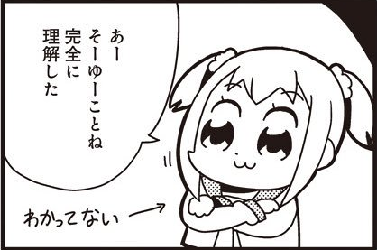
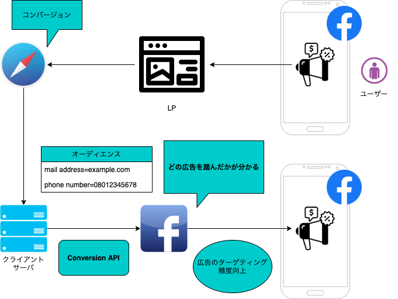
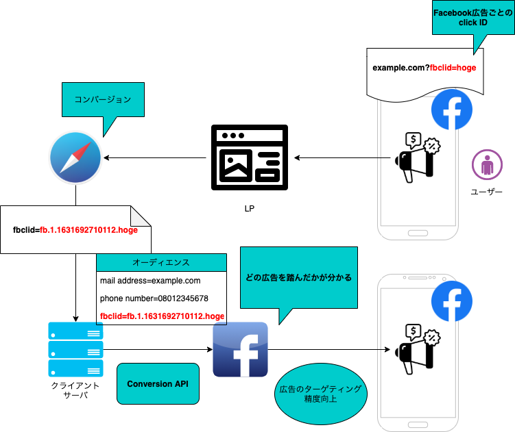

<!-- _class: lead invert -->
<!-- _paginate: false -->

# 新しい広告最適化 ~Conversion API の概要と導入実装~

 

TU  坂田誠也

---

<!-- _class: gaia -->

## 目標

- Conversion API成立の背景についてざっくり理解する

- Conversion APIの仕様についてざっくり理解し、Facebookのみならずこれからの広告ビジネスの主軸になることをざっくり理解する

- 様々な導入方法があり要件によって検討すること

---

<!-- _class: gaia -->

---

<!-- _class: gaia -->

## この話のまとめ

- Conversion API は近年の急速な個人情報規制と ITPが背景

- サーバからのウェブイベント送信で欠損の補完と従来捕捉できなかったオフラインイベントも計測可能に

- 導入は shopify のようなプラグイン利用から独自実装まで幅広いので要件とユースケースに合わせて検討

---

<!-- _class: gaia -->

## お前だれよ

- 坂田誠也(28 歳)

- 最近は TypeScript、GCP、terraform とか

これは特に関係の無い初回盤月姫のアニメイト特典 A4 アクリルパネル（かわいい）

---

<!-- _class: gaia -->

## 注意

今回の発表で話す Conversion API はウェブイベント測定のためのツールなのでアプリには対応していません。

以降「アプリ」と表記されるものは「モバイルアプリ」（特に iOS アプリ）、「ウェブ」はウェブアプリについてです

---

<!-- _class: gaia -->

## お品書き

- Conversion API の概要

- Conversion API の背景

- Conversion API の利用目的

- Conversion API の導入と設計

---

<!-- _class: gaia -->

## Conversion API の概要

[Facebook Conversion API](https://ja-jp.facebook.com/business/help/2041148702652965?id=818859032317965)（以下 Conversion API）は Facebook から提供されている、ウェブイベントやオフラインイベントを Facebook に共有するためのインターフェースです。

実体は Facebook の[グラフ API](https://developers.facebook.com/docs/graph-api?locale=ja_JP)(GraphQL とは別)で提供されている API の一つ。

サーバサイドからのウェブイベントのハンドリングを行うため、クッキーレスでの計測が可能になります。

---

<!-- _class: gaia -->

## Conversion API の概要

「コンバージョン API は、主要なウェブイベントやオフラインイベントおよび顧客のアクションを自分のサーバーから Facebook のサーバーに直接共有するための Facebook ビジネスツールです。コンバージョン API は Facebook ピクセルと連携して機能し、Facebook 広告キャンペーンのパフォーマンスや効果測定を改善するのに役立ちます。」
（コンバージョン API について | Facebook Business ヘルプセンターより）

---

<!-- _class: gaia -->

## Conversion API の背景

- Cookie 規制

- 政府による規制強化

  - EU 一般データ保護規則(GDPR)

  - カリフォルニア州消費者プライバシー法(CCPA)

- **ITP(Intelligent Tracking Prevention)**

- iOS14.5 の新しいポリシー
  - AppTrackingTransparency(ATT)
  - SKAdNetwork

---

<!-- _class: gaia -->

### ITP(Intelligent Tracking Prevention)

safari に搭載されたトラッキング防止機能

Conversion API成立において大きなインパクトを与えた

[Full Third-Party Cookie Blocking and More](https://webkit.org/blog/10218/full-third-party-cookie-blocking-and-more/)

---

<!-- _class: gaia -->

### ITP(Intelligent Tracking Prevention)

#### 3rd Party Cookie

例外なく全てブロック

#### ストレージ(LocalStorage, Indexed DB, Service Worker registrations and cache, etc...)

トラッカー判定されている web サイトから流入し LP の URL にパラメータやフラグメントが付与されている場合、ユーザーの最後のインタラクションから 7 日、インタラクションが無く直帰の場合は即時でストレージデータ削除

#### リファラー取得

JavaScript の`document.referer`によるリファラー取得内容のダウングレード

---

<!-- _class: gaia -->

## Conversion API の背景

iOS14.5 の新しいポリシー概要

- プライバシーラベル義務化

- オプトイン設定画面義務化

- API を通じたトラッキング義務化

---

<!-- _class: gaia -->

## Conversion API の背景

少し寄り道してiOS14.5 の新しいポリシー概要

- **プライバシーラベル義務化**

- オプトイン設定画面義務化

- API を通じたトラッキング義務化

---

<!-- _class: gaia -->

### プライバシーラベル義務化

全てのアプリは、

- アプリが収集するユーザーデータの種類

- データを収集する目的

- ユーザーの匿名化

について、Apple の App Store Connect を通じて提示する必要がある。

---

<!-- _class: gaia -->

### プライバシーラベル義務化

画像:Apple Music のプライバシーラベル

---

<!-- _class: gaia -->

### オプトイン設定画面義務化

App Store で公開されている Facebook などのアプリは、Apple の AppTrackingTransparency(ATT)を通じて、Third Party のアプリとウェブサイトにおけるトラッキングの許可を利用者に求める必要があります。

オプトインしないと IDFA(iOS のデバイス識別子)が共有されず顧客データがイベントに使用できない。

---

<!-- _class: gaia -->

### API を通じたトラッキング義務化

Facebook やその他のプラットフォームは、イベントのレポートを制限及び合算し遅延させる新たなフレームワーク SKAdNetwork(SKAN)API を導入する必要がある。

IDFA にアクセスすることなくイベントの計測を行えるが制限が強いため以前のような計測は行えない。

---

<!-- _class: gaia -->

## Conversion API の利用目的

- 従来の効果計測の補完と拡張

- オーディエンスによる広告最適化

---

<!-- _class: gaia -->

### 従来の効果計測の補完

従来のイベントの送信だと欠損が生じて、実際に発生したイベントの数とずれることがある。

- ITP

- 3rd Party Cookie の制限

---

<!-- _class: gaia -->

### 従来の効果計測の補完

購入者情報と Facebook ユーザーの情報を照会して購入者と広告を踏んだ人をマッチングする。

---

<!-- _class: gaia -->

### 新たな計測対象

ウェブイベントで取得できない深いイベントの計測と最適化

---

<!-- _class: gaia -->

### オーディエンスによる広告最適化

---

<!-- _class: gaia -->

### オーディエンスによる広告最適化

---

<!-- _class: gaia -->
## 疑問

### Q1. 効果あるの？

### A1. あります。

#### セゾン自動車火災保険株式会社

webイベントのみとConversion APIとの併用のキャンペーンで検証し、**CPAは-14%、CV件数送付量は+16%**
https://markezine.jp/article/detail/36718

#### 株式会社sparty

セゾンと同様の検証を行い、**CPMが-23%、CPA-11%、CV件数送付量が+13%**
https://cyberace.co.jp/news/post-1017/

---

<!-- _class: gaia -->
## 疑問

### Q2. 他メディアは無いの？

### A2. ありそうだが未調査

ただしFacebookは例えばGoogleとかYahooなどと違って広告収入への依存度が相対的に高いため力を入れており、他メディアで同等の機能が提供されるかは不明（知ってたら教えてください）

---

<!-- _class: gaia -->

## Conversion API の設計・実装

Conversion API の導入方法

1. プラグインによるノーコード実装
2. 他社サービスによる実装
3. 独自実装

---

<!-- _class: gaia -->

### プラグインによるノーコード実装

Facebook Conversion API と統合可能なサービスを使用することで、ほぼノーコードで導入・実装することができます。

実際に使ったことはないので詳細はあまりわからないですが導入のしやすさは一番でしょう。

---

<!-- _class: gaia -->

### 他社サービスによる実装

大きく二つあり、他社の ASP 連携を行うのと自社サーバでの開発支援の依頼があります。

コストは統合先によりますが、プラグインでの導入よりも格段にできることが増えて自由度は上がります。

[ポスト Cookie 時代に備えた広告効果計測ソリューションの導入支援サービス、株式会社フィードフォースがアナグラム株式会社と共同で提供開始](https://prtimes.jp/main/html/rd/p/000000067.000071307.html)

[トランスコスモス、Cookie規制対策後のデータ活用を推進するデータマーケティングチームを発足](https://www.trans-cosmos.co.jp/company/news/210615.html)

[ONE’s Data](https://onesdata.com/)

---

<!-- _class: gaia -->

### 自前実装

自前実装の素朴な例

---

<!-- _class: gaia -->

### クライアントでの設計・実装

オフレコなので画面共有で見せます。

