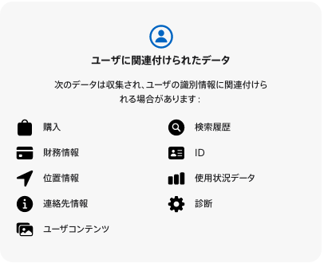
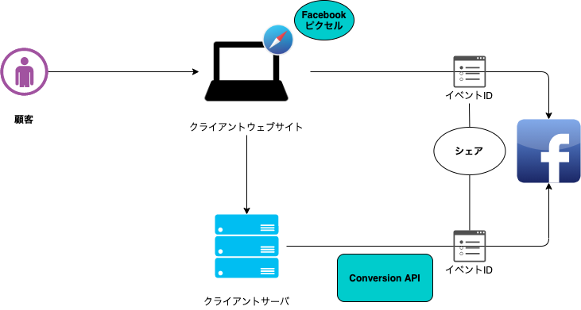

<!-- _class: lead invert -->
<!-- _paginate: false -->

# 新しい広告最適化 Conversion API ~概要と導入実装~

 

TU  坂田誠也

---

<!-- _class: gaia -->

## この話のまとめ

- Conversion API は近年の急速な個人情報規制と Apple の新ポリシーが背景

- サーバからのウェブイベント送信で欠損の補完と従来捕捉できなかったオフラインイベントも計測可能に

- 導入は shopify のようなプラグイン利用から独自実装まで幅広いので要件とユースケースに合わせて検討

---

<!-- _class: gaia -->

## お前だれよ

- 坂田誠也(28 歳)

- 最近は TypeScript、GCP、terraform とか

これは初回盤リメイク月姫のアニメイト特典 A4 アクリルパネル

---

<!-- _class: gaia -->

## 注意

背景として Apple の iOS14 のポリシー変更の話を避けて通ることができません（そしてややこしい）

**アプリの話かそうでないか**を区別してください

以下で「アプリ」と表記されるものは「モバイルアプリ」（特に iOS アプリ）、「ウェブ」はウェブアプリについてです

---

<!-- _class: gaia -->

## 注意

今回の発表で話す Conversion API はウェブイベント測定のためのツールなのでアプリには対応していません。

---

<!-- _class: gaia -->

## お品書き

- Conversion API の概要

- Conversion API の背景

  - プライバシーラベル義務化

  - オプトイン設定画面義務化

  - API を通じたトラッキング義務化

- Conversion API の利用目的

- Conversion API の導入と設計

  - Conversion API の導入

  - Conversion API の設計・実装

---

<!-- _class: gaia -->

## Conversion API の概要

[Facebook Conversion API](https://ja-jp.facebook.com/business/help/2041148702652965?id=818859032317965)（以下 Conversion API）は Facebook から提供されている、ウェブイベントやオフラインイベントを Facebook に共有するためのインターフェースです。

実体は Facebook の[グラフ API](https://developers.facebook.com/docs/graph-api?locale=ja_JP)(GraphQL とは別)で提供されている API の一つ。

---

<!-- _class: gaia -->

## Conversion API の概要

「コンバージョン API は、主要なウェブイベントやオフラインイベントおよび顧客のアクションを自分のサーバーから Facebook のサーバーに直接共有するための Facebook ビジネスツールです。コンバージョン API は Facebook ピクセルと連携して機能し、Facebook 広告キャンペーンのパフォーマンスや効果測定を改善するのに役立ちます。」
（コンバージョン API について | Facebook Business ヘルプセンターより）

---

<!-- _class: gaia -->

## Conversion API の背景

- Cookie 規制

- 政府による規制強化

  - EU 一般データ保護規則(GDPR)

  - カリフォルニア州消費者プライバシー法(CCPA)

- **ITP(Intelligent Tracking Prevention)**

- iOS14.5 の新しいポリシー
  - **ATT(AppTrackingTransparency)**
  - **SKAdNetwork**

---

<!-- _class: gaia -->

### ITP(Intelligent Tracking Prevention)

safari に搭載されたトラッキング防止機能

#### 3rd Party Cookie

例外なく全てブロック

#### ストレージ(LocalStorage, Indexed DB, Service Worker registrations and cache, etc...)

トラッカー判定されている web サイトから流入し LP の URL にパラメータやフラグメントが付与されている場合、ユーザーの最後のインタラクションから 7 日、インタラクションが無く直帰の場合は即時でストレージデータ削除

#### リファラー取得

JavaScript の`document.referer`によるリファラー取得内容のダウングレード

[Full Third-Party Cookie Blocking and More](https://webkit.org/blog/10218/full-third-party-cookie-blocking-and-more/)

---

<!-- _class: gaia -->

## Conversion API の背景

iOS14.5 の新しいポリシー概要

- プライバシーラベル義務化

- オプトイン設定画面義務化

- API を通じたトラッキング義務化

---

<!-- _class: gaia -->

## Conversion API の背景

iOS14.5 の新しいポリシー概要

- **プライバシーラベル義務化**

- オプトイン設定画面義務化

- API を通じたトラッキング義務化

---

<!-- _class: gaia -->

### プライバシーラベル義務化

全てのアプリは、

- アプリが収集するユーザーデータの種類

- データを収集する目的

- ユーザーの匿名化

について、Apple の App Store Connect を通じて提示する必要がある。

---

<!-- _class: gaia -->

### プライバシーラベル義務化

画像:Apple Music のプライバシーラベル

---

<!-- _class: gaia -->

## Conversion API の背景

iOS14.5 の新しいポリシー

- プライバシーラベル義務化

- **オプトイン設定画面義務化**

- API を通じたトラッキング義務化

どれも広告ビジネスに対してインパクトが大きく、影響範囲はあらゆる利用者やプラットフォーマー、マーケターに及びます

---

<!-- _class: gaia -->

### オプトイン設定画面義務化

App Store で公開されている Facebook などのアプリは、Apple の AppTrackingTransparency(ATT)を通じて、Third Party のアプリとウェブサイトにおけるトラッキングの許可を利用者に求める必要があります。

オプトインしないと IDFA(iOS のデバイス識別子)が共有されず顧客データがイベントに使用できない。

---

<!-- _class: gaia -->

### API を通じたトラッキング義務化

Facebook やその他のプラットフォームは、イベントのレポートを制限及び合算し遅延させる新たなフレームワーク SKAdNetwork(SKAN)API を導入する必要がある。

IDFA にアクセスすることなくイベントの計測を行えるが制限が強いため以前のような計測は行えない。

---

<!-- _class: gaia -->

## Conversion API の利用目的

- 従来の効果計測の補完と拡張

- オーディエンスによる広告最適化

---

<!-- _class: gaia -->

### 従来の効果計測の補完

従来のイベントの送信だと欠損が生じて、実際に発生したイベントの数とずれることがある。

- ITP

- 3rd Party Cookie の制限

---

<!-- _class: gaia -->

### 従来の効果計測の補完

---

<!-- _class: gaia -->

### オーディエンスによる広告最適化

---

<!-- _class: gaia -->

## Conversion API の設計・実装
